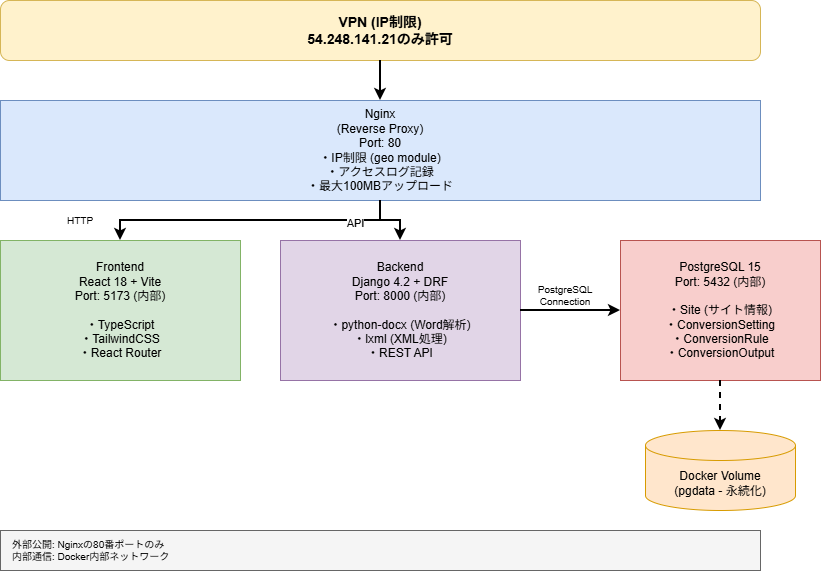
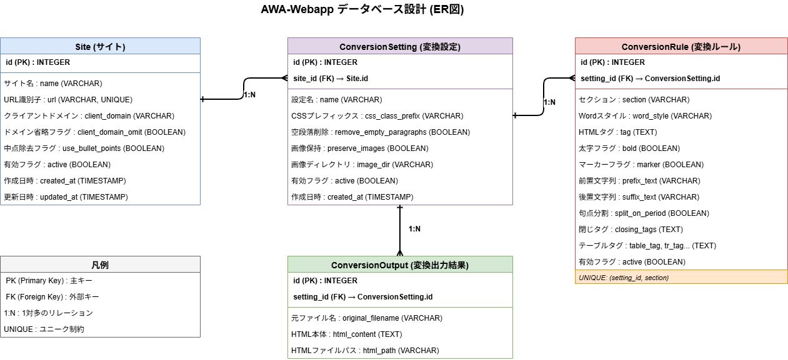

# AWA-Webapp 引継ぎドキュメント

> **作成日**: 2025年12月17日  
> **対象者**: プロジェクト引継ぎ担当者  
> **目的**: システムの理解と運用・保守に必要な情報の提供

---

## 目次

1. [プロジェクト概要](#プロジェクト概要)
2. [システム構成](#システム構成)
3. [データベース設計（ER図）](#データベース設計er図)
4. [技術スタック](#技術スタック)
5. [ディレクトリ構成](#ディレクトリ構成)
6. [主要機能の説明](#主要機能の説明)
7. [セキュリティ設計](#セキュリティ設計)
8. [トラブルシューティング](#トラブルシューティング)
9. [クリーンコードガイドライン](#クリーンコードガイドライン)
10. [マルチテナント化への提案](#マルチテナント化への提案)

---

## プロジェクト概要

### プロジェクトの目的

AWA-WebappはWordファイル（.docx）をHTML形式に変換するWebアプリケーションです。各クライアントサイトごとにカスタマイズされた変換ルールを適用し、WordPress等のCMSに投稿可能なHTMLコードを生成します。

### 主な利用者

- **社内スタッフ**: Wordファイルをアップロードし、HTML変換を実行
- **管理者**: サイト設定、変換ルール、変換設定を管理

### ビジネス価値

- **作業効率化**: 手作業でのHTML作成時間を大幅削減
- **品質統一**: 各サイトのHTMLフォーマットを自動で統一
- **柔軟性**: サイトごとにカスタマイズ可能な変換ルール

### システムフロー

```
1. ユーザーがWordファイルをアップロード
   ↓
2. バックエンドでdocxファイルをパース（python-docx）
   ↓
3. XMLファイルを抽出し、サーバーに保存
   ↓
4. 選択された変換設定に基づいてルールを適用
   ↓
5. HTML形式で変換・整形
   ↓
6. データベースに保存 & ユーザーに結果を表示
   ↓
7. ユーザーがHTMLをダウンロードまたはコピー
```

---

## システム構成

### アーキテクチャ図

**Draw.ioファイル**: [`diagrams/architecture.drawio`](../diagrams/architecture.drawio)

**閲覧方法**:
1. **VSCode/Cursorで開く**: Draw.io Integration拡張機能をインストール後、`.drawio`ファイルをクリック
2. **Webで開く**: [https://app.diagrams.net/](https://app.diagrams.net/) からファイルを開く
3. **PNG画像を生成**: 上記いずれかで開いて「Export as PNG」で画像化



※ 画像が表示されない場合は、上記の方法で`.drawio`ファイルを開くか、README.mdの「図の画像生成」セクションを参照してPNG画像を生成してください。

**構成要素**:
- **VPN層**: IP制限（54.248.141.21のみ許可）
- **Nginx**: リバースプロキシ、Port 80公開
- **Frontend**: React 18 + Vite (内部Port: 5173)
- **Backend**: Django 4.2 + DRF (内部Port: 8000)
- **PostgreSQL**: データベース (内部Port: 5432)
- **Docker Volume**: データ永続化 (pgdata)

### Dockerコンテナ構成

| サービス名 | イメージ | 公開ポート | 内部ポート | 役割 |
|-----------|---------|-----------|-----------|------|
| nginx | nginx:alpine | 80 | 80 | リバースプロキシ、IP制限 |
| frontend | カスタム | - | 5173 | React SPA |
| backend | カスタム | - | 8000 | Django REST API |
| db | postgres:15 | - | 5432 | データベース |

**ネットワーク構成**:
- 外部公開: nginxの80番ポートのみ
- 内部通信: Docker内部ネットワーク（デフォルト）
- データ永続化: Docker Volume (`pgdata`)

---

## データベース設計（ER図）

### ER図（エンティティリレーションシップ図）

**Draw.ioファイル**: [`diagrams/er_diagram.drawio`](../diagrams/er_diagram.drawio)

**閲覧方法**:
1. **VSCode/Cursorで開く**: Draw.io Integration拡張機能をインストール後、`.drawio`ファイルをクリック
2. **Webで開く**: [https://app.diagrams.net/](https://app.diagrams.net/) からファイルを開く
3. **PNG画像を生成**: 上記いずれかで開いて「Export as PNG」で画像化



※ 画像が表示されない場合は、上記の方法で`.drawio`ファイルを開くか、README.mdの「図の画像生成」セクションを参照してPNG画像を生成してください。

**テーブル構成**:
- **Site**: サイトマスタ（クライアントサイト情報）
- **ConversionSetting**: 変換設定（Siteに紐付く）
- **ConversionRule**: 変換ルール（ConversionSettingに紐付く）
- **ConversionOutput**: 変換出力結果（ConversionSettingに紐付く）

**主要なリレーション**:
- Site → ConversionSetting (1:N)
- ConversionSetting → ConversionRule (1:N)
- ConversionSetting → ConversionOutput (1:N)

### 主要リレーション

1. **Site → ConversionSetting**: 1対多（1サイトに複数の変換設定）
2. **ConversionSetting → ConversionRule**: 1対多（1変換設定に複数のルール）
3. **ConversionSetting → ConversionOutput**: 1対多（1変換設定で複数の変換結果）

### テーブル詳細

#### Site (サイトマスタ)

各クライアントサイトの基本情報を管理。

- `url`: サイトを一意に識別するための短縮名（例: "cheerjob", "example-site"）
- `client_domain`: クライアントサイトの本番ドメイン（リンク生成に使用）
- `client_domain_omit`: 内部リンク時にドメインを省略するかのフラグ
- `use_bullet_points`: 中点（・）を除去してulタグで囲むかのフラグ

#### ConversionSetting (変換設定)

各サイトごとの変換動作を定義。

- `css_class_prefix`: 生成するHTMLのCSSクラスに付けるプレフィックス
- `preserve_images`: 画像を保持するかどうか
- `image_dir`: 画像を保存するディレクトリ名

#### ConversionRule (変換ルール)

Wordの各要素（見出し、段落、表など）をどのようなHTMLに変換するかを定義。

**sectionフィールドの選択肢**:
- タイトル、目次、大見出し、中見出し、小見出し
- 内部リンク、外部リンク
- 太字、ハイライト、赤字
- 箱の枠、箱内リンクテキスト、箱内テキスト（中点）
- 表、テキスト、ショートコード、文頭、文末

**word_styleフィールドの選択肢**:
- 見出し１、見出し２、見出し３、見出し４
- 標準、Wordに記載なし

**重要なフィールド**:
- `tag`: 適用するHTMLタグ（例: `<h2>{content}</h2>`）
- `split_on_period`: 句点（。）で段落を分割してタグを閉じる
- `closing_tags`: セクション終了時に挿入する閉じタグ
- `table_*`: テーブル変換用のタグ設定

#### ConversionOutput (変換結果)

変換されたHTMLの履歴を保存。ダウンロードやプレビューに使用。

---

## 技術スタック

### バックエンド

| 技術 | バージョン | 用途 |
|-----|-----------|------|
| Python | 3.x | プログラミング言語 |
| Django | 4.2.10 | Webフレームワーク |
| Django REST Framework | 3.14.0 | REST API構築 |
| PostgreSQL | 15 | データベース |
| python-docx | 1.1.0 | Word文書の解析 |
| lxml | 4.9.3 | XML処理 |
| Pillow | 10.1.0 | 画像処理 |
| gunicorn | 21.2.0 | WSGIサーバー（本番用） |
| python-decouple | 3.8 | 環境変数管理 |
| django-cors-headers | 4.3.1 | CORS設定 |
| psycopg2-binary | 2.9.9 | PostgreSQLアダプタ |

### フロントエンド

| 技術 | バージョン | 用途 |
|-----|-----------|------|
| React | 18.3.1 | UIフレームワーク |
| TypeScript | 5.8.3 | 型安全な開発 |
| Vite | 6.3.5 | ビルドツール |
| React Router | 6.30.1 | ルーティング |
| TailwindCSS | 3.4.17 | CSSフレームワーク |
| ESLint | 9.25.0 | コード品質チェック |

### インフラ・デプロイ

| 技術 | バージョン | 用途 |
|-----|-----------|------|
| Docker | - | コンテナ化 |
| Docker Compose | V2 | マルチコンテナ管理 |
| Nginx | alpine | リバースプロキシ、IP制限 |
| Linux | Ubuntu (AWS EC2) | ホストOS |

### データベース

- **PostgreSQL 15**: リレーショナルデータベース
- **Docker Volume**: データの永続化

---

## ディレクトリ構成

```
AWA-Webapp/
├── backend/                      # Django バックエンド
│   ├── api/                      # メインアプリケーション
│   │   ├── migrations/           # データベースマイグレーション
│   │   ├── services/             # ビジネスロジック層
│   │   │   ├── converter.py     # Word → HTML 変換ロジック
│   │   │   └── xml_to_html_converter.py  # XML処理
│   │   ├── models.py             # データモデル定義
│   │   ├── serializers.py        # DRFシリアライザ
│   │   ├── views.py              # APIビュー（エンドポイント）
│   │   ├── urls.py               # APIルーティング
│   │   └── admin.py              # Django管理画面設定
│   ├── app/                      # Django プロジェクト設定
│   │   ├── settings.py           # 設定ファイル（環境変数、DB、セキュリティ）
│   │   ├── urls.py               # ルートURLconf
│   │   └── wsgi.py               # WSGIエントリーポイント
│   ├── media/                    # アップロードファイル保存先
│   │   ├── uploads/temp/         # 一時アップロード
│   │   ├── images/               # 画像ファイル
│   │   └── html/                 # 変換後HTMLファイル
│   ├── xml_data/                 # 抽出されたXMLファイル
│   ├── test_data/                # テスト用Wordファイル
│   ├── Dockerfile                # Dockerイメージ定義
│   ├── requirements.txt          # Python依存パッケージ
│   └── README.md                 # バックエンド説明
│
├── frontend/                     # React フロントエンド
│   ├── src/
│   │   ├── pages/                # ページコンポーネント
│   │   │   ├── Start-screen.tsx  # スタート画面（サイト選択）
│   │   │   ├── Setting-screen.tsx # 設定画面（変換ルール管理）
│   │   │   └── Generation-screen.tsx # 変換実行画面
│   │   ├── components/           # 再利用可能なUIコンポーネント
│   │   ├── styles/               # スタイルファイル
│   │   ├── App.tsx               # ルートコンポーネント
│   │   └── main.tsx              # エントリーポイント
│   ├── public/                   # 静的ファイル
│   ├── Dockerfile                # Dockerイメージ定義
│   ├── package.json              # npm依存パッケージ
│   ├── vite.config.ts            # Vite設定
│   ├── tailwind.config.js        # TailwindCSS設定
│   └── tsconfig.json             # TypeScript設定
│
├── nginx/                        # Nginx リバースプロキシ
│   ├── nginx.conf                # Nginx設定（IP制限、ルーティング）
│   └── logs/                     # アクセスログ、エラーログ
│
├── docker-compose.yml            # Docker Compose設定
├── rules.md                      # 開発・デプロイルール
├── README.md                     # プロジェクト説明
└── HANDOVER.md                   # 引継ぎドキュメント（本ファイル）
```

### 重要なディレクトリの説明

#### `backend/api/services/`
ビジネスロジックを含むサービス層。MVCパターンのService層に相当。

- **converter.py**: Wordファイルをパースし、変換ルールを適用してHTML生成
- **xml_to_html_converter.py**: docxファイルから抽出したXMLを処理

#### `backend/media/`
ユーザーがアップロードしたファイルや生成されたファイルを保存。

- Dockerボリュームマウントされており、コンテナ再起動後も保持される
- 定期的なクリーンアップが推奨

#### `backend/xml_data/`
変換時に一時的に抽出されるXMLファイル群を保存。

- Word文書の内部構造を解析するために使用
- ディスク容量に注意（定期削除推奨）

---

## 主要機能の説明

### 機能一覧

| 機能名 | 説明 | 担当画面 |
|-------|------|---------|
| サイト管理 | クライアントサイト情報の登録・編集・削除 | Start-screen |
| 変換設定管理 | サイトごとの変換設定の作成・編集 | Setting-screen |
| 変換ルール管理 | 見出し、段落、表などの変換ルールを定義 | Setting-screen |
| Word → HTML変換 | Wordファイルをアップロードし、HTML生成 | Generation-screen |
| 変換結果プレビュー | 生成されたHTMLをプレビュー表示 | Generation-screen |
| HTMLダウンロード | 変換結果をHTMLファイルとしてダウンロード | Generation-screen |
| 変換履歴管理 | 過去の変換結果を保存・参照 | Backend DB |

### Word → HTML変換の詳細フロー

#### 1. ファイルアップロード

```python
# backend/api/views.py - WordConversionView
POST /api/convert/
- リクエスト: multipart/form-data
  - file: .docxファイル
  - setting_id: 変換設定ID
- バリデーション:
  - ファイル拡張子が.docxであること
  - ファイルサイズが100MB以下であること
  - 指定された変換設定が存在し有効であること
```

#### 2. Wordファイルの解析

```python
# backend/api/services/converter.py - DocumentParser
- python-docxライブラリでWordファイルを読み込み
- docxファイルをZIPとして展開
- document.xml等のXMLファイルを抽出し保存
- 段落（paragraphs）を解析
  - テキスト内容
  - スタイル情報（見出し1〜4、標準など）
  - 太字、マーカー、赤字などの書式
- テーブル（tables）を解析
  - 行・列構造
  - セル内のテキストと書式
- 画像（images）を解析
  - 画像ファイルの抽出
  - 画像パスの保存
```

#### 3. 変換ルールの適用

```python
# backend/api/services/converter.py - RuleApplier
- ConversionRuleテーブルから該当ルールを取得
- 各段落・テーブルに対して以下を適用:
  - Wordスタイルとセクションのマッチング
  - 太字・マーカー判定
  - HTMLタグの適用（{content}をテキストで置換）
  - prefix_text / suffix_text の追加
  - 句点分割処理（split_on_period）
  - 中点の除去とul/liタグ化（use_bullet_points）
  - 内部リンク・外部リンクの処理
```

#### 4. HTML生成・保存

```python
# backend/api/services/converter.py - WordToHtmlConverter
- 変換されたHTMLをメモリ上で構築
- 以下の処理を実行:
  - 空段落の削除（remove_empty_paragraphs）
  - CSSクラスの付与（css_class_prefix）
  - 画像のパス調整（preserve_images）
- HTMLファイルとして保存（media/html/）
- ConversionOutputテーブルに記録:
  - original_filename
  - html_content
  - html_path
- レスポンスをフロントエンドに返却
```

#### 5. プレビューとダウンロード

```typescript
// frontend/src/pages/Generation-screen.tsx
- 変換結果のHTMLを画面表示
- コピーボタンでクリップボードにコピー
- ダウンロードボタンでHTMLファイル取得
  - GET /api/download/?id={output_id}
```

### API エンドポイント一覧

| エンドポイント | メソッド | 説明 | リクエスト | レスポンス |
|--------------|---------|------|-----------|-----------|
| `/api/sites/` | GET | サイト一覧取得 | - | Site[] |
| `/api/sites/` | POST | サイト新規作成 | name, url, client_domain等 | Site |
| `/api/sites/{id}/` | GET | サイト詳細取得 | - | Site |
| `/api/sites/{id}/` | PATCH | サイト情報更新 | name, url等 | Site |
| `/api/sites/{id}/` | DELETE | サイト削除（論理削除） | - | 204 |
| `/api/settings/` | GET | 変換設定一覧 | ?site_id=X | ConversionSetting[] |
| `/api/settings/` | POST | 変換設定作成 | site_id, name等 | ConversionSetting |
| `/api/settings/{id}/` | PATCH | 変換設定更新 | name, css_class_prefix等 | ConversionSetting |
| `/api/rules/` | GET | 変換ルール一覧 | ?setting_id=X | ConversionRule[] |
| `/api/rules/` | POST | 変換ルール作成 | setting_id, section, tag等 | ConversionRule |
| `/api/rules/{id}/` | PATCH | 変換ルール更新 | tag, prefix_text等 | ConversionRule |
| `/api/rules/{id}/` | DELETE | 変換ルール削除（論理削除） | - | 204 |
| `/api/convert/` | POST | Word → HTML変換 | file, setting_id | ConversionOutput |
| `/api/download/` | GET | HTML取得 | ?id=X | HTMLファイル |
| `/api/outputs/` | GET | 変換履歴一覧 | ?setting_id=X | ConversionOutput[] |

---

## セキュリティ設計

### セキュリティ対策一覧

#### 1. ネットワークレベル（最重要）

**IP制限（Nginx）**:
```nginx
geo $allowed_ip {
    default 0;                    # デフォルトは拒否
    54.248.141.21 1;             # VPN接続時のIPアドレスのみ許可
    172.16.0.0/12 1;             # Docker内部ネットワーク範囲
    192.168.0.0/16 1;            # Docker内部ネットワーク範囲（予備）
}
if ($allowed_ip = 0) {
    return 403 "Access denied from your IP address: $remote_addr";
}
```

- **設計思想**: ネットワークレベルで完全にアクセスを遮断
- **許可IP**: VPN経由のIPアドレス（54.248.141.21）のみ
- **拒否時の動作**: 403 Forbiddenを返却

#### 2. アプリケーションレベル

**Djangoセキュリティミドルウェア**:
- `SecurityMiddleware`: セキュリティヘッダーの自動付与
- `CsrfViewMiddleware`: CSRF攻撃対策
- `XFrameOptionsMiddleware`: クリックジャッキング対策
- `AuthenticationMiddleware`: 認証処理

**パスワード検証**（Django管理画面ログイン用）:
Djangoの管理画面（`/admin/`）にアクセスする管理者アカウントのパスワードに対して、以下の検証ルールが適用されています：
- ユーザー情報との類似性チェック
- 最小文字数チェック（デフォルト8文字以上）
- 一般的なパスワードの禁止
- 数字のみのパスワード禁止

**注意**: 現在、一般ユーザー向けの認証機能は実装されていません（IP制限のみ）。マルチテナント化時に認証機能の追加を推奨します。

#### 3. ファイルアップロードセキュリティ

**ファイル検証**:
```python
# ファイルサイズ制限
FILE_UPLOAD_MAX_MEMORY_SIZE = 104857600  # 100MB
DATA_UPLOAD_MAX_MEMORY_SIZE = 104857600  # 100MB

# ファイル拡張子チェック
if ext.lower() not in ['.docx']:
    return Response({"error": "サポートされていないファイル形式です"})
```

**対策内容**:
- ファイルサイズ制限（100MB）
- 許可拡張子: .docxのみ
- 一時ファイルの自動削除
- ファイル名のサニタイズ（slugify）

#### 4. 環境変数管理

```python
# settings.py
from decouple import config

SECRET_KEY = config('SECRET_KEY', default='django-insecure-key-for-dev')
DEBUG = config('DEBUG', default=True, cast=bool)
POSTGRES_PASSWORD = config('POSTGRES_PASSWORD', default='postgres')
```

- 機密情報を環境変数で管理
- `.env`ファイルはGit管理外
- デフォルト値は開発環境用のみ

#### 5. ログ監視

```python
LOGGING = {
    'version': 1,
    'formatters': {
        'verbose': {
            'format': '{levelname} {asctime} {module} {message}',
        },
    },
    'handlers': {
        'console': {'class': 'logging.StreamHandler', 'formatter': 'verbose'},
    },
    'root': {'handlers': ['console'], 'level': 'DEBUG'},
}
```

- 全リクエストのログ記録
- エラー詳細の記録
- アクセスIPアドレスの記録

### セキュリティ上の改善推奨事項

#### 現状の問題点

1. **CORS設定が緩い**:
```python
CORS_ALLOW_ALL_ORIGINS = True
CORS_ALLOW_CREDENTIALS = True
```
→ **推奨**: 特定のオリジンのみ許可
```python
CORS_ALLOWED_ORIGINS = [
    "http://54.248.141.21",
    "https://your-domain.com",
]
```

2. **REST API権限が緩い**:
```python
REST_FRAMEWORK = {
    'DEFAULT_PERMISSION_CLASSES': [
        'rest_framework.permissions.AllowAny',
    ],
}
```
→ **推奨**: 認証必須に変更
```python
REST_FRAMEWORK = {
    'DEFAULT_PERMISSION_CLASSES': [
        'rest_framework.permissions.IsAuthenticated',
    ],
}
```

3. **ALLOWED_HOSTSが緩い**:
```python
ALLOWED_HOSTS = ['*']
```
→ **推奨**: 特定ホストのみ許可
```python
ALLOWED_HOSTS = ['54.248.141.21', 'your-domain.com']
```

4. **DEBUGモードが有効**:
```python
DEBUG = config('DEBUG', default=True, cast=bool)
```

**DEBUGモードの影響**:

DEBUGモード（`DEBUG=True`）の場合：
- **メリット**:
  - エラー時に詳細なスタックトレースが表示される
  - 開発時のデバッグが容易
  - SQLクエリの実行履歴が確認できる
  
- **デメリット（セキュリティリスク）**:
  - エラー画面にソースコードの一部や環境変数が表示される
  - データベース構造やファイルパスが漏洩する可能性
  - パフォーマンスが低下する（メモリ内にクエリ履歴を保持）
  - 機密情報が外部に漏れる危険性

→ **推奨**: 本番環境では必ずFalseに設定
```bash
# docker-compose.yml
environment:
  - DEBUG=False
```

---

## トラブルシューティング

### よくある問題と解決方法

#### 問題1: コンテナが起動しない

**症状**:
```bash
docker compose up -d
# エラーメッセージが表示される
```

**原因と解決策**:

| 原因 | 確認方法 | 解決策 |
|-----|---------|--------|
| ポート競合 | `sudo lsof -i :80` | 使用中のプロセスを停止 `kill -9 <PID>` |
| イメージ破損 | `docker images` | イメージ再ビルド `docker compose build --no-cache` |
| ボリューム破損 | `docker volume ls` | ボリューム削除・再作成 `docker compose down -v && docker compose up -d` |
| メモリ不足 | `free -h` | 1. 不要なコンテナ削除 `docker system prune -a`<br>2. 古いファイル削除（`backend/xml_data/*`, `backend/media/html/*`）<br>3. AWSインスタンスタイプ変更（t2.micro → t2.small等） |
| ディスク容量不足 | `df -h` | 1. 古い変換ファイル削除<br>2. Dockerイメージクリーンアップ<br>3. EBSボリューム拡張（AWS） |

**完全リセット手順**:
```bash
# 1. すべてのコンテナとボリュームを削除
docker compose down -v

# 2. イメージを削除
docker rmi $(docker images -q)

# 3. システムクリーンアップ
docker system prune -a -f

# 4. 再構築
docker compose build --no-cache
docker compose up -d
```

#### 問題2: データベース接続エラー

**症状**:
```
django.db.utils.OperationalError: could not connect to server: Connection refused
```

**原因**:
- PostgreSQLコンテナが起動していない
- 環境変数の設定ミス
- ネットワーク設定の問題

**解決策**:
```bash
# 1. DBコンテナの状態確認
docker compose ps db

# 2. DBコンテナのログ確認
docker compose logs db

# 3. 環境変数確認
docker compose exec backend env | grep POSTGRES

# 4. DBコンテナを再起動
docker compose restart db

# 5. マイグレーション再実行
docker compose exec backend python app/manage.py migrate
```

#### 問題3: マイグレーションエラー

**症状**:
```
django.db.migrations.exceptions.InconsistentMigrationHistory
```

**原因**:
- マイグレーションファイルとDB状態の不整合

**解決策（注意: データが消える可能性あり）**:
```bash
# 1. バックアップ作成
docker compose exec backend python app/manage.py dumpdata > backup.json

# 2. データベースをリセット
docker compose down -v
docker compose up -d db

# 3. マイグレーション再実行
docker compose exec backend python app/manage.py migrate

# 4. データ復元（必要に応じて）
docker compose exec backend python app/manage.py loaddata backup.json
```

#### 問題4: Wordファイル変換エラー

**症状**:
```
変換処理中にエラーが発生しました: ...
```

**原因と解決策**:

| エラーメッセージ | 原因 | 解決策 |
|---------------|------|--------|
| "サポートされていないファイル形式" | .docx以外のファイル | .docx形式で保存し直す |
| "指定された変換設定が見つかりません" | 変換設定が削除された | 有効な変換設定を選択 |
| "ファイルサイズが大きすぎます" | 100MB超過 | ファイルサイズを削減 |
| "XMLファイルが見つかりません" | xml_dataディレクトリの問題 | ディレクトリ権限確認 `ls -la backend/xml_data/` |

**デバッグ手順**:
```bash
# 1. バックエンドのログを確認
docker compose logs -f backend

# 2. テストファイルで動作確認
curl -X POST http://localhost:8000/api/convert/ \
  -F "file=@backend/test_data/test.docx" \
  -F "setting_id=1"

# 3. xml_dataディレクトリのクリーンアップ
sudo rm -rf backend/xml_data/*
```

#### 問題5: フロントエンドが表示されない

**症状**:
- ブラウザで http://54.248.141.21 にアクセスしても画面が表示されない
- "Cannot GET /" エラー

**原因と解決策**:

```bash
# 1. Nginxログ確認
docker compose logs nginx

# 2. フロントエンドログ確認
docker compose logs frontend

# 3. フロントエンドを再起動
docker compose restart frontend

# 4. ビルドエラーの確認
docker compose exec frontend npm run build

# 5. node_modulesの再インストール
docker compose exec frontend npm install
```

#### 問題6: IP制限で403エラー

**症状**:
```
Access denied from your IP address: XXX.XXX.XXX.XXX
```

**原因**:
- VPN未接続
- IPアドレスが変更された

**解決策**:
```bash
# 1. 現在のIPアドレスを確認
curl ifconfig.me

# 2. nginx.confを編集
vim nginx/nginx.conf

# geo $allowed_ip に新しいIPを追加
geo $allowed_ip {
    default 0;
    54.248.141.21 1;  # 既存
    XXX.XXX.XXX.XXX 1;  # 追加
}

# 3. Nginxを再起動
docker compose restart nginx
```

#### 問題7: xml_dataディレクトリの肥大化

**症状**:
- ディスク容量が圧迫される
- 変換処理が遅くなる

**解決策**:
```bash
# 1. ディスク使用量確認
du -sh backend/xml_data/

# 2. 古いXMLファイルを削除（7日以上前）
find backend/xml_data/ -type d -mtime +7 -exec rm -rf {} +

# または全削除（安全）
sudo rm -rf backend/xml_data/*
```

### ログ確認コマンド

```bash
# すべてのサービスのログ
docker compose logs -f

# 特定のサービスのログ
docker compose logs -f backend
docker compose logs -f frontend
docker compose logs -f nginx

# 最新100行のログ
docker compose logs --tail=100 backend

# タイムスタンプ付きログ
docker compose logs -f -t backend
```

### デバッグTips

#### Djangoシェルでデータ確認

```bash
# Djangoシェル起動
docker compose exec backend python app/manage.py shell

# Python対話シェル内で
>>> from api.models import Site, ConversionSetting, ConversionRule
>>> Site.objects.all()
>>> ConversionSetting.objects.filter(active=True)
>>> ConversionRule.objects.filter(setting_id=1)
```

#### データベース直接確認

```bash
# PostgreSQLコンテナに接続
docker compose exec db psql -U postgres -d awa_webapp

# SQL実行
# \dt  # テーブル一覧
# SELECT * FROM api_site;
# SELECT * FROM api_conversionsetting;
# \q  # 終了
```

#### curlでAPI動作確認

```bash
# サイト一覧取得
curl http://localhost:8000/api/sites/

# 変換設定一覧取得
curl http://localhost:8000/api/settings/?site_id=1

# Word変換実行
curl -X POST http://localhost:8000/api/convert/ \
  -F "file=@test.docx" \
  -F "setting_id=1"
```

---

## クリーンコードガイドライン

### コーディング規約

#### Python（バックエンド）

**PEP 8準拠**:
```python
# Good
class WordToHtmlConverter:
    """Wordファイルを変換するクラス"""
    
    def __init__(self, conversion_setting):
        self.setting = conversion_setting
        self.css_prefix = self.setting.css_class_prefix or ""
    
    def convert(self, word_file) -> Tuple[str, List[str]]:
        """
        Wordファイルを変換する
        
        Args:
            word_file: Wordファイルオブジェクト
            
        Returns:
            Tuple[str, List[str]]: (HTML文字列, 画像リスト)
        """
        pass

# Bad
class wordToHtmlConverter:  # クラス名はパスカルケース
    def convert(self,word_file):  # カンマの後にスペース
        pass  # ドキュメント文字列がない
```

**命名規則**:
- クラス名: PascalCase (`WordToHtmlConverter`)
- 関数名・変数名: snake_case (`convert_to_html`, `user_name`)
- 定数: UPPER_SNAKE_CASE (`MAX_FILE_SIZE`, `DEFAULT_TIMEOUT`)
- プライベート: アンダースコア始まり (`_internal_method`)

**型ヒント（推奨）**:
```python
from typing import Dict, List, Optional

def parse_table(self, table: Any) -> Optional[Dict[str, Any]]:
    """テーブルを解析する"""
    rows: List[Dict] = []
    # ...
    return {"rows": rows, "columns": len(table.columns)}
```

#### TypeScript（フロントエンド）

**命名規則**:
- コンポーネント: PascalCase (`GenerationScreen`)
- 関数・変数: camelCase (`handleSubmit`, `userName`)
- 型・インターフェース: PascalCase (`SiteData`, `ConversionRule`)
- 定数: UPPER_SNAKE_CASE (`API_BASE_URL`)

**型定義の活用**:
```typescript
// Good
interface SiteData {
  id: number;
  name: string;
  url: string;
  active: boolean;
}

const fetchSites = async (): Promise<SiteData[]> => {
  const response = await fetch('/api/sites/');
  return response.json();
};

// Bad
const fetchSites = async () => {  // 戻り値の型がない
  const response = await fetch('/api/sites/');
  return response.json();  // 型不明
};
```

### アーキテクチャ原則

#### 1. 関心の分離（Separation of Concerns）

**バックエンド**: レイヤードアーキテクチャ

```
views.py (プレゼンテーション層)
   ↓ リクエスト/レスポンス処理
services/converter.py (ビジネスロジック層)
   ↓ 変換ロジック
models.py (データアクセス層)
   ↓ データベース操作
PostgreSQL (データ層)
```

**フロントエンド**: コンポーネントベース

```
pages/ (ページコンポーネント)
   ↓ ページレベルのロジック
components/ (再利用可能なUI)
   ↓ UI表示のみ
API呼び出し (fetch)
```

#### 2. DRY原則（Don't Repeat Yourself）

```python
# Good: 共通処理をメソッド化
class RuleApplier:
    def apply_rules(self, content, rules):
        for rule in rules:
            content = self._apply_single_rule(content, rule)
        return content
    
    def _apply_single_rule(self, content, rule):
        # 共通処理
        pass

# Bad: コピー&ペースト
def apply_heading_rule(content):
    # 同じ処理をコピー
    pass

def apply_paragraph_rule(content):
    # 同じ処理をコピー
    pass
```

#### 3. 単一責任の原則（Single Responsibility Principle）

```python
# Good: 各クラスが単一の責任を持つ
class DocumentParser:
    """Wordファイルの解析のみを担当"""
    def parse_document(self, doc_file):
        pass

class RuleApplier:
    """変換ルールの適用のみを担当"""
    def apply_rules(self, content, rules):
        pass

class HtmlGenerator:
    """HTML生成のみを担当"""
    def generate_html(self, parsed_content):
        pass

# Bad: 1つのクラスが多すぎる責任を持つ
class WordConverter:
    def parse_document(self):
        pass
    def apply_rules(self):
        pass
    def generate_html(self):
        pass
    def save_to_db(self):
        pass
    def send_email(self):
        pass
```

### コメント・ドキュメント

**ドキュメント文字列（Docstring）**:
```python
def convert_bullet_points(self, text: str) -> str:
    """
    中点（・）をulタグのリストに変換する
    
    Args:
        text (str): 変換対象のテキスト
        
    Returns:
        str: ulタグで囲まれたHTML
        
    Examples:
        >>> convert_bullet_points("・項目1\\n・項目2")
        '<ul><li>項目1</li><li>項目2</li></ul>'
    """
    pass
```

**コメントの使い方**:
```python
# Good: WHYを説明
# HACK: python-docxではマーカーの色情報が取得できないため、
# XMLを直接パースして判定する
marker_color = self._extract_marker_color_from_xml(paragraph)

# Bad: WHATを説明（コードを見れば分かる）
# 変数iをインクリメントする
i += 1
```

### テストの推奨事項

#### 単体テスト（推奨）

```python
# backend/api/tests.py
from django.test import TestCase
from .services.converter import WordToHtmlConverter
from .models import Site, ConversionSetting

class WordConverterTestCase(TestCase):
    def setUp(self):
        self.site = Site.objects.create(name="Test Site", url="test")
        self.setting = ConversionSetting.objects.create(
            site=self.site,
            name="Test Setting"
        )
    
    def test_convert_heading(self):
        """見出し変換のテスト"""
        converter = WordToHtmlConverter(self.setting)
        # テストロジック
        self.assertEqual(result, expected)
```

**テスト実行**:
```bash
# すべてのテストを実行
docker compose exec backend python app/manage.py test

# 特定のテストのみ実行
docker compose exec backend python app/manage.py test api.tests.WordConverterTestCase
```

### セキュアコーディング

#### SQLインジェクション対策

```python
# Good: ORMを使用
Site.objects.filter(name=user_input)

# Bad: 生SQLで文字列連結
cursor.execute(f"SELECT * FROM site WHERE name = '{user_input}'")
```

#### XSS対策

```python
# Good: エスケープ処理
from django.utils.html import escape
safe_html = escape(user_input)

# Reactでは自動エスケープされる
<div>{userInput}</div>
```

#### ファイルパストラバーサル対策

```python
# Good: パスを正規化
from pathlib import Path
safe_path = (Path(settings.MEDIA_ROOT) / user_filename).resolve()
if not str(safe_path).startswith(str(settings.MEDIA_ROOT)):
    raise ValueError("Invalid path")

# Bad: 直接結合
file_path = settings.MEDIA_ROOT + user_filename  # ../../../etc/passwd
```

---

## マルチテナント化への提案

### マルチテナント化の目的

現在のシステムは単一組織での利用を想定していますが、他社にもサービスとして提供するには、**マルチテナント対応**が必要です。

### マルチテナントアーキテクチャの選択肢

#### オプション1: データベース分離方式（推奨）

**概要**: テナントごとに独立したデータベースを使用

```
┌──────────────────────┐
│  Tenant A Database   │ ← 企業A専用
└──────────────────────┘

┌──────────────────────┐
│  Tenant B Database   │ ← 企業B専用
└──────────────────────┘
```

**メリット**:
- データ完全分離でセキュリティ最高
- バックアップ・復元がテナント単位で可能
- パフォーマンス影響の隔離
- カスタマイズが容易

**デメリット**:
- データベース管理コストが高い
- スキーマ変更時に全DBに適用必要
- リソース効率が低い

#### オプション2: スキーマ分離方式

**概要**: 1つのデータベース内で、テナントごとに異なるスキーマを使用

```
PostgreSQL Database
├── tenant_a_schema
│   ├── api_site
│   ├── api_conversionsetting
│   └── ...
└── tenant_b_schema
    ├── api_site
    ├── api_conversionsetting
    └── ...
```

**メリット**:
- データ分離とリソース効率のバランスが良い
- バックアップが一括で可能
- 接続数削減

**デメリット**:
- PostgreSQL特有の機能（Djangoのサポートが限定的）
- クエリ時にスキーマ指定が必要

#### オプション3: テーブル共有方式（最もシンプル）

**概要**: 全テナントが同じテーブルを共有し、tenant_idで区別

```
api_site テーブル
| id | tenant_id | name         | ...
|----|-----------|--------------|----
| 1  | A         | Site A1      | ...
| 2  | A         | Site A2      | ...
| 3  | B         | Site B1      | ...
```

**メリット**:
- 実装が最もシンプル
- リソース効率が最も高い
- クエリパフォーマンスが良い
- Djangoとの親和性が高い

**デメリット**:
- データ漏洩リスク（クエリミスでテナント間データ漏洩の可能性）
- 大規模テナントがパフォーマンスに影響
- バックアップがテナント単位で不可

### 推奨アーキテクチャ: テーブル共有方式

**理由**:
- Djangoとの親和性が高く、既存コードの変更が最小限
- 小〜中規模のSaaS向けとして十分なセキュリティ
- 開発・運用コストが低い

### 実装手順

#### ステップ1: Tenantモデルの追加

```python
# backend/api/models.py
from django.db import models
from django.contrib.auth.models import User

class Tenant(models.Model):
    """テナント（企業）モデル"""
    name = models.CharField('企業名', max_length=255)
    subdomain = models.CharField('サブドメイン', max_length=50, unique=True)
    created_at = models.DateTimeField('作成日時', auto_now_add=True)
    is_active = models.BooleanField('有効', default=True)
    
    # プラン情報
    plan = models.CharField('プラン', max_length=50, default='free')
    max_sites = models.IntegerField('最大サイト数', default=5)
    max_conversions_per_month = models.IntegerField('月間変換上限', default=100)
    
    class Meta:
        verbose_name = 'テナント'
        verbose_name_plural = 'テナント'
    
    def __str__(self):
        return self.name


class TenantUser(models.Model):
    """テナントとユーザーの紐付け"""
    tenant = models.ForeignKey(Tenant, on_delete=models.CASCADE)
    user = models.ForeignKey(User, on_delete=models.CASCADE)
    role = models.CharField('役割', max_length=20, default='member')
    # role choices: 'owner', 'admin', 'member'
    
    class Meta:
        unique_together = ['tenant', 'user']
```

#### ステップ2: 既存モデルにtenant_idを追加

```python
# backend/api/models.py
class Site(models.Model):
    tenant = models.ForeignKey(
        Tenant,
        on_delete=models.CASCADE,
        related_name='sites',
        verbose_name='テナント'
    )
    name = models.CharField('サイト名', max_length=255)
    url = models.CharField('URL', max_length=100, help_text='サイトのURL（英小文字）')
    # ... その他のフィールド
    
    class Meta:
        unique_together = ['tenant', 'url']  # テナント内でユニーク


# ConversionSetting, ConversionRule等も同様に修正
# （Siteを通じて間接的にテナントが特定できるため、直接tenant_idは不要）
```

#### ステップ3: Middlewareでテナント判定

```python
# backend/api/middleware.py
from django.utils.deprecation import MiddlewareMixin
from .models import Tenant

class TenantMiddleware(MiddlewareMixin):
    """テナントを識別してリクエストに紐付けるミドルウェア"""
    
    def process_request(self, request):
        # サブドメインからテナントを特定
        host = request.get_host()
        subdomain = host.split('.')[0]
        
        try:
            tenant = Tenant.objects.get(subdomain=subdomain, is_active=True)
            request.tenant = tenant
        except Tenant.DoesNotExist:
            # デフォルトテナントまたはエラー処理
            request.tenant = None
        
        return None
```

```python
# backend/app/settings.py
MIDDLEWARE = [
    'django.middleware.security.SecurityMiddleware',
    'django.contrib.sessions.middleware.SessionMiddleware',
    'corsheaders.middleware.CorsMiddleware',
    'django.middleware.common.CommonMiddleware',
    'django.middleware.csrf.CsrfViewMiddleware',
    'django.contrib.auth.middleware.AuthenticationMiddleware',
    'api.middleware.TenantMiddleware',  # ← 追加
    'django.contrib.messages.middleware.MessageMiddleware',
    'django.middleware.clickjacking.XFrameOptionsMiddleware',
]
```

#### ステップ4: ViewSetでテナントフィルタリング

```python
# backend/api/views.py
class SiteViewSet(viewsets.ModelViewSet):
    serializer_class = SiteSerializer
    
    def get_queryset(self):
        """ログインユーザーのテナントに紐付くサイトのみ取得"""
        if not hasattr(self.request, 'tenant') or not self.request.tenant:
            return Site.objects.none()
        
        return Site.objects.filter(
            tenant=self.request.tenant,
            active=True
        )
    
    def perform_create(self, serializer):
        """新規作成時に自動的にテナントを設定"""
        serializer.save(tenant=self.request.tenant)
```

#### ステップ5: 認証・認可の実装

```python
# backend/api/authentication.py
from rest_framework.authentication import SessionAuthentication, TokenAuthentication

REST_FRAMEWORK = {
    'DEFAULT_AUTHENTICATION_CLASSES': [
        'rest_framework.authentication.SessionAuthentication',
        'rest_framework.authentication.TokenAuthentication',
    ],
    'DEFAULT_PERMISSION_CLASSES': [
        'rest_framework.permissions.IsAuthenticated',  # AllowAnyから変更
    ],
}
```

```python
# ユーザー登録API
from rest_framework import viewsets, status
from rest_framework.decorators import action
from django.contrib.auth.models import User

class AuthViewSet(viewsets.ViewSet):
    @action(detail=False, methods=['post'], permission_classes=[AllowAny])
    def register(self, request):
        """新規ユーザー登録"""
        username = request.data.get('username')
        password = request.data.get('password')
        email = request.data.get('email')
        tenant_name = request.data.get('tenant_name')
        subdomain = request.data.get('subdomain')
        
        # テナント作成
        tenant = Tenant.objects.create(
            name=tenant_name,
            subdomain=subdomain
        )
        
        # ユーザー作成
        user = User.objects.create_user(
            username=username,
            password=password,
            email=email
        )
        
        # テナントとユーザーを紐付け
        TenantUser.objects.create(
            tenant=tenant,
            user=user,
            role='owner'
        )
        
        return Response({'message': 'Registration successful'})
```

#### ステップ6: マイグレーション実行

```bash
# 1. マイグレーションファイル生成
docker compose exec backend python app/manage.py makemigrations

# 2. マイグレーション実行
docker compose exec backend python app/manage.py migrate

# 3. 既存データに対してデフォルトテナントを設定
docker compose exec backend python app/manage.py shell
>>> from api.models import Tenant, Site
>>> default_tenant = Tenant.objects.create(name="Default Tenant", subdomain="default")
>>> Site.objects.update(tenant=default_tenant)
```

### サブドメイン設定

**DNS設定**:
```
*.your-domain.com → サーバーIPアドレス

例:
company-a.your-domain.com → 54.248.141.21
company-b.your-domain.com → 54.248.141.21
```

**Nginx設定**:
```nginx
server {
    listen 80;
    server_name ~^(?<subdomain>.+)\.your-domain\.com$;
    
    location / {
        proxy_pass http://frontend;
        proxy_set_header Host $host;
        proxy_set_header X-Tenant-Subdomain $subdomain;
    }
}
```

### プラン・課金の実装（将来的に）

```python
class Tenant(models.Model):
    # ... 既存フィールド
    
    # プラン情報
    PLAN_CHOICES = [
        ('free', 'フリープラン'),
        ('basic', 'ベーシックプラン'),
        ('pro', 'プロプラン'),
        ('enterprise', 'エンタープライズプラン'),
    ]
    plan = models.CharField('プラン', max_length=20, choices=PLAN_CHOICES, default='free')
    
    # 制限事項
    max_sites = models.IntegerField('最大サイト数', default=3)
    max_conversions_per_month = models.IntegerField('月間変換上限', default=50)
    max_file_size_mb = models.IntegerField('最大ファイルサイズ(MB)', default=10)
    
    # 課金情報
    stripe_customer_id = models.CharField('Stripe顧客ID', max_length=255, blank=True)
    subscription_start_date = models.DateField('契約開始日', null=True, blank=True)
    subscription_end_date = models.DateField('契約終了日', null=True, blank=True)


def check_conversion_limit(tenant):
    """月間変換上限をチェック"""
    from datetime import datetime
    current_month = datetime.now().strftime('%Y-%m')
    conversions_this_month = ConversionOutput.objects.filter(
        setting__site__tenant=tenant,
        created_at__startswith=current_month
    ).count()
    
    if conversions_this_month >= tenant.max_conversions_per_month:
        raise Exception("月間変換上限に達しました。プランをアップグレードしてください。")
```

### セキュリティ強化（マルチテナント対応）

#### Row Level Security（行レベルセキュリティ）

```python
# すべてのクエリで自動的にテナントフィルタを適用
class TenantModelMixin(models.Model):
    """テナント対応のベースモデル"""
    tenant = models.ForeignKey(Tenant, on_delete=models.CASCADE)
    
    class Meta:
        abstract = True
    
    @classmethod
    def get_queryset_for_tenant(cls, tenant):
        return cls.objects.filter(tenant=tenant)


# 使用例
class Site(TenantModelMixin):
    name = models.CharField(max_length=255)
    # ...
```

#### テナント間データ漏洩防止のテスト

```python
# backend/api/tests.py
class TenantIsolationTestCase(TestCase):
    def setUp(self):
        self.tenant_a = Tenant.objects.create(name="Tenant A", subdomain="tenant-a")
        self.tenant_b = Tenant.objects.create(name="Tenant B", subdomain="tenant-b")
        
        self.site_a = Site.objects.create(tenant=self.tenant_a, name="Site A")
        self.site_b = Site.objects.create(tenant=self.tenant_b, name="Site B")
    
    def test_tenant_cannot_access_other_tenant_data(self):
        """テナントAがテナントBのデータにアクセスできないことを確認"""
        queryset = Site.objects.filter(tenant=self.tenant_a)
        self.assertIn(self.site_a, queryset)
        self.assertNotIn(self.site_b, queryset)
```

### モニタリング・分析（推奨）

```python
# テナント別使用状況の記録
class TenantUsageLog(models.Model):
    tenant = models.ForeignKey(Tenant, on_delete=models.CASCADE)
    action = models.CharField(max_length=50)  # 'conversion', 'download'
    user = models.ForeignKey(User, on_delete=models.SET_NULL, null=True)
    timestamp = models.DateTimeField(auto_now_add=True)
    file_size_mb = models.FloatField(null=True, blank=True)
    
    class Meta:
        indexes = [
            models.Index(fields=['tenant', 'timestamp']),
        ]
```

---

## まとめ

### 引継ぎチェックリスト

- [ ] 本ドキュメントの通読
- [ ] システム構成図の理解
- [ ] ER図の理解
- [ ] ローカル環境での起動確認
- [ ] 各API Endpointの動作確認
- [ ] Word変換の動作確認
- [ ] ログ確認方法の理解
- [ ] トラブルシューティング手順の把握
- [ ] セキュリティ設定の理解
- [ ] バックアップ・復元手順の確認
- [ ] マルチテナント化の方針理解

### 緊急連絡先

| 項目 | 情報 |
|-----|------|
| サーバーIP | 54.248.141.21 |
| VPN許可IP | 54.248.141.21 |
| PostgreSQLポート | 5432 (Docker内部) |
| 管理画面URL | http://54.248.141.21/admin/ |
| ログ保存先 | nginx/logs/ |

### 参考資料

- [Django公式ドキュメント](https://docs.djangoproject.com/)
- [Django REST Framework公式](https://www.django-rest-framework.org/)
- [python-docx公式](https://python-docx.readthedocs.io/)
- [React公式ドキュメント](https://react.dev/)
- [Docker公式ドキュメント](https://docs.docker.com/)

---

**最終更新日**: 2025年12月17日

